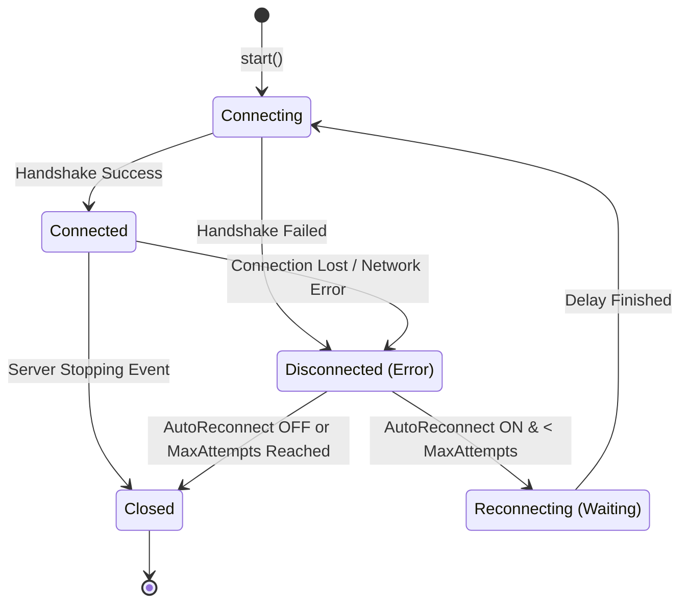

# Minecraft Server Management Protocol (MSMP)

`tech.aliorpse.mcutils:mcutils-msmp`

> [!tip]
> This module requires a Ktor client engine (e.g., `ktor-client-cio`).

## Common Usage

### Basic Connection

The easiest way to connect is using the `msmpClient` DSL.

```kotlin
val client = MCServer.msmpClient("ws://localhost:25585", "your_token") {
    // Optional configuration
    autoReconnect = true
    maxReconnectAttempts = 5
}

client.use { client ->
    // Start connection logic
    client.connect()

    // Wait until connected, or you can skip this; all requests will be suspended until connected
    client.awaitState<MsmpState.Connected>()

    // Interact with the server
    val players = client.players.get()
    println("Online players: ${players.size}")

    // Wait for the client to close (e.g., server stopping or manual close)
    // You could use `coroutineScope { ... }` for the same effect, but you know it will add an indentation level.
    client.await()
}
```

### Built-in Extensions

MSMP comes with high-level extensions for common tasks.

```kotlin
// Server management
client.server.status()
client.server.stop()
client.server.sendMessage(message = "Hello World!", overlay = true)

// Player management
val players: Set<PlayerDto> = client.players.get()
client.players.kick("Aliorpse", message = "Kicked by admin")

// Settings
client.serverSettings.allowFlight.set(true)
client.gamerules.set("send_command_feedback", true)

// Allow/Ban lists
client.allowList.add(PlayerDto(name = "Aliorpse"))
client.banList.remove(UserBanDto(name = "Aliorpse"))
```

### Events

You can listen for events or state changes.

```kotlin
// Observe state
client.on<MsmpState> {
    println("State changed: $this")
}

// Receive events
client.on<PlayerJoinedEvent> {
    println("${eventCtx.name} joined the server")
}

// Suspend until a specific event
val event = client.awaitEvent<ServerStartedEvent>()
```

Note: Event subscriptions persist across reconnections, but no events are buffered during the disconnected period.

### Lifecycle



## Advanced Features

### Configuration

Some configuration options for `msmpClient`:

```kotlin
val client = MCServer.msmpClient("...") {
    autoReconnect = true
    maxRetryDelay = 30000
    failFast = true // Stop if the first connection attempt fails
    batchDelay = 30 // Group concurrent requests (ms)
}
```

### Infrastructure API (Raw Calls)

```kotlin
// Simple call
val response: JsonElement = client.call("minecraft:server/status")

// Call with arguments
client.call(
    "minecraft:players/kick",
    // You can pass arguments as Maps or DTOs
    mapOf("player" to "Aliorpse", "reason" to "Bye")
)

// Call with manual serialization
val players: Set<PlayerDto> = client.call(
    "minecraft:players",
    SetSerializer(PlayerDto.serializer())
)
```

### Reactive State Management

Extensions implementing `Syncable` (like `players`, `gamerules`) maintain a local cache synchronized with the server.

```kotlin
client.players.flow.collect { players ->
    println("Online players: ${players.size}")
}
```

But please note that the flow may be empty the first time you access the extension.

## Custom Extensions

You can build your own high-level API extensions.

### Creating an Extension

```kotlin
public class WorldExtension internal constructor(
    public override val client: MsmpClient,
    public override val baseEndpoint: String
) : MsmpExtension {
    public suspend fun getTime(): Long =
        client.call(
            "$baseEndpoint/time",
            Long.serializer()
        )

    public suspend inline fun setTime(time: Long): Long =
        client.call(
            "$baseEndpoint/time/set",
            mapOf("time" to time)
        )
}

// Registering the extension
public val MsmpClient.world: WorldExtension
    by msmpExtension("minecraft:world", ::WorldExtension) {
        // Optional: setup logic, e.g., cache sync
    }
```

There is a variant of `msmpExtension` that allows you to use explicit serializers for generic typed extensions. Check the documentation for it.

### Custom Events

```kotlin
@Serializable
public data class PlayerJoinedEvent(val eventCtx: PlayerDto) : MsmpEvent

public data object ServerStartedEvent : MsmpEvent

public data class IPBanRemovedEvent(val eventCtx: String) : MsmpEvent

// Then register them:
MsmpEventRegistry.configure {
    // Map JSON to a data class
    "minecraft:notification/players/joined" register PlayerJoinedEvent.serializer()

    // For events without a body
    "minecraft:notification/server/started" bind ServerStartedEvent

    // Manual parsing for primitive or complex logic
    "minecraft:notification/ip_bans/removed".define { IPBanRemovedEvent(it?.jsonPrimitive?.content ?: "") }
}
```

For the full API reference, please refer to the project's [dokka](https://aliorpse.github.io/mcutils/msmp/).
